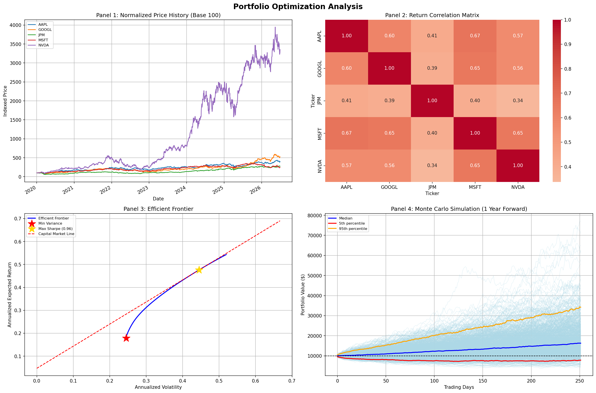

# Quantitative Portfolio Optimization Engine

A python based portfolio analysis tool that implements Modern Portfolio Theory from mathematical first principles. Built as a structured quant finance self-study project over 4 weeks.

## Overview
This projects constructs an optimal multi-asset portfolio using Markowitz mean-variance optimization, traces the efficient frontier, identifies the max Sharpe ratio portfolio and stress-tests it using Monte Carlo forward simulation with Value at Risk and Conditional Value at Risk metrics.
The engine accpts any user-identified list of stock tickers and date ranges and will produce a full quantitative analysis automatically.

## Mathematical Framework

**Mean-Variance Optimization (Markowitz):**
Portfolio expected return is weighted sum of individual asset returns:
E[R_p]: w^T * mu. Portfolio variance is the quadratic form w^T * sigma * w with sigma = covariance matrix of returns. The optimizer will find the weight vector w that minimizes variance for a given target return subject to sum of weights being 1.

**Efficient Frontier:**
Set of portfolios that maximize expected return for each level of risk. Computed by solving the constrained optimization problem across 100 target return levels between the minimum variance return and the maximum achievable return.

**Capital Market Line and Market Portfolio:**
The maximum Sharpe ratio portfolio is the tangency point between the Capital Market Line and the efficient frontier. It represents the optimal balance of return per unit of risk, defined as (E[R_p] - r_f) / sigma_p.

**Monte Carlo Forward Simulation:**  
Portfolio returns are simulated by drawing 1,000 correlated daily return paths from a multivariate normal distribution parameterized by the historical mean vector and covariance matrix. Returns are compounded forward across one trading year to produce a distribution of future portfolio values.

**Value at Risk and CVaR:**  
The 95% VaR identifies the loss threshold exceeded on only 5% of days. CVaR (Expected shortfall) computes the average loss conditional on exceeding that threshold, showing the tail severity that VaR alone cannot quantify. Three VaR methods are compared: historical simulation, parametric (normal assumption), and Monte Carlo-based.

## Results

